# Introduction

This repo tries to benchmark the following implementations of
transducer loss in terms of speed and memory consumption:

- [k2][k2]
- [torchaudio][torchaudio]
- [optimized_transducer][optimized_transducer]

The benchmark results are saved in <https://huggingface.co/csukuangfj/transducer-loss-benchmarking>


## TODOs

- [ ] Add benchmark results for [warp-transducer][warp-transducer] and [warprnnt_numba][warprnnt_numba]


# Environment setup

## Install torchaudio
Please refer to <https://github.com/pytorch/audio> to install torchaudio.
Note: It requires `torchaudio >= 0.10.0`.

## Install k2

Please refer to <https://k2-fsa.github.io/k2/installation/index.html> to install k2.
Note: It requires at `k2 >= v1.13`.

## Install PyTorch profiler TensorBoard plugin

```bash
pip install torch-tb-profiler
```

Please refer to <https://github.com/pytorch/kineto/tree/main/tb_plugin> for other alternatives.


# Steps to get the benchmark results

## Step 0: Clone the repo

```bash
git clone https://github.com/csukuangfj/transducer-loss-benchmarking.git
```

## Step 1: Generate shape information from training data (Can be skipped)

Since padding matters in transducer loss computation, we get the shape information
for `logits` and `targets` from the subset `train-clean-100` of the [LibriSpeech][LibriSpeech]
dataset to make the benchmark results more realistic.

We use the script <https://github.com/k2-fsa/icefall/blob/master/egs/librispeech/ASR/prepare.sh>
to prepare the manifest of `train-clean-100`. This script also produces a BPE model with vocabulary
size 500.

The script `./generate_shape_info.py` in this repo generates a 2-D tensor, where each row has 2 columns
containing information abut each utterance in `train-clean-100`:
  - Column 0 contains the number of acoustic frames after subsampling, i.e., the `T` in transducer loss computation
  - Column 1 contains the number of BPE tokens, i.e., the `U` in transducer loss computation

**Hint**: We have saved the generated file `./shape_info.pt` in this repo so you don't need
to run this step. If you want to do benchmarks on other dataset, you will find `./generate_shape_info.py`
very handy.

## Step 2: Run benchmarks

We have the following benchmarks so far:


| Name                      |  Script                     | Benchmark Result folder         |
|---------------------------|-----------------------------|---------------------------------|
| `torchaudio`              | `./benchmark_torchaudio.py` | `./log/torchaudio-30`           |
| `optimized_transducer`    | `./benchmark_ot.py`         | `./log/optimized_transducer-30` |
| `k2`                      | `./benchmark_k2.py`         | `./log/k2-30`                   |
| `k2 pruned loss`          | `./benchmark_k2_pruned.py`  | `./log/k2-pruned-30`            |

The first column shows the names of different implementations of transducer loss, the second
column gives the command to run the benchmark, and the last column is the
output folder containing the results of running the corresponding script.

**HINT**: The suffix 30 in the output folder indicates the batch size used during the benchmark.
Batch size 30 is selected since `torchaudio` throws CUDA OOM error if batch size 40 is used.

**HINT**: We have uploaded the benchmark results to
<https://huggingface.co/csukuangfj/transducer-loss-benchmarking>. You can download and visualize
it without running any code.

**Note**: We use the following command for benchmarking:

```python3
prof = torch.profiler.profile(
    activities=[ProfilerActivity.CPU, ProfilerActivity.CUDA],
    schedule=torch.profiler.schedule(
        wait=10, warmup=10, active=20, repeat=2
    ),
    on_trace_ready=torch.profiler.tensorboard_trace_handler(
        f"./log/k2-{batch_size}"
    ),
    record_shapes=True,
    with_stack=True,
    profile_memory=True,
)
```
The first 10 batches are skipped for warm up, the next 10 batches are ignored,
and the subsequent 20 batches are used for benchmarking.


## Step 3: Visualize Results

You can use tensorboard to visualize the benchmark results. For instance, to visualize
the results for `k2 pruned loss`, you can use

```bash
tensorboard --logdir ./log/k2-pruned-30 --port 6007
```

|  Name     |  Overview  | Memory  |
|-----------|------------|---------|
|torchaudio | 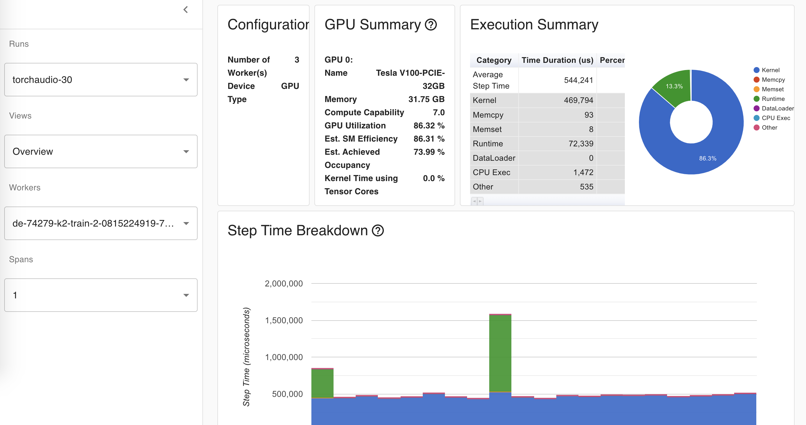 | 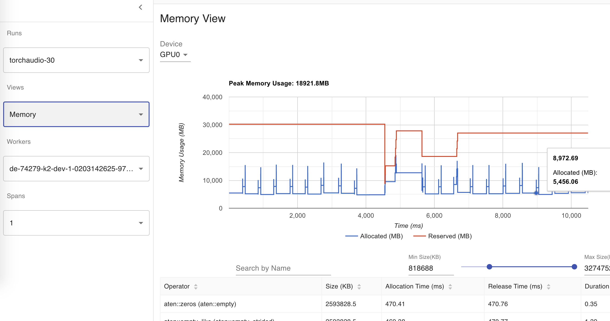|
|k2 | 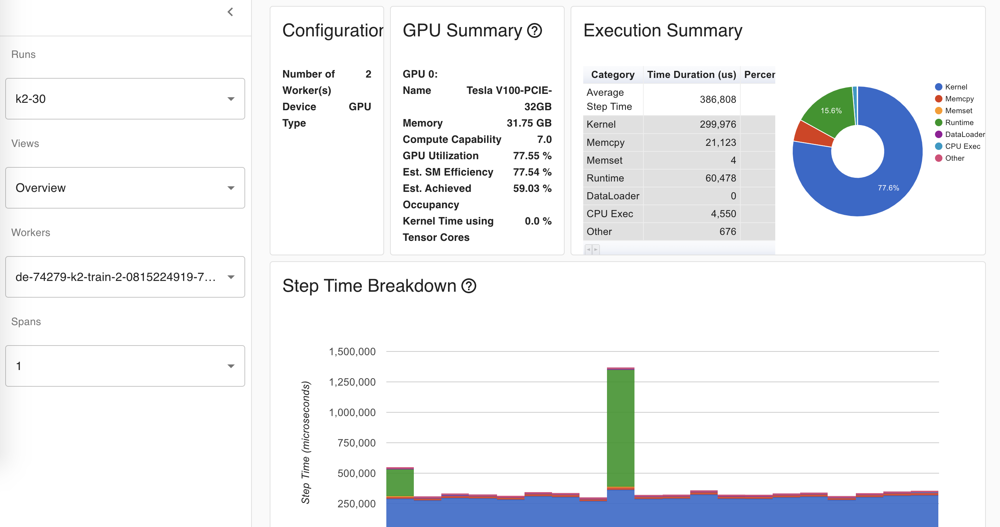 | 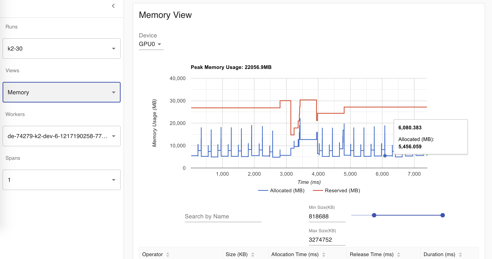|
|k2 pruned | 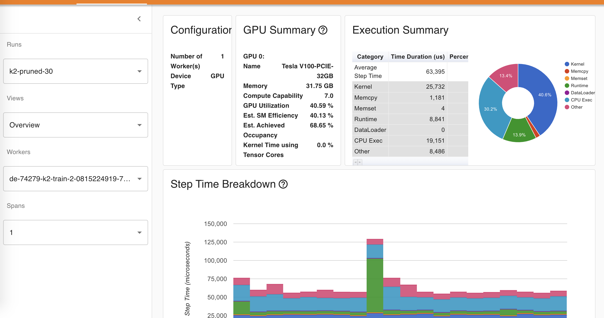 | 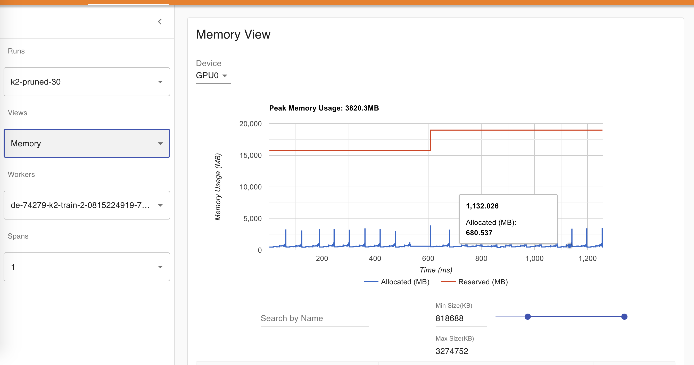|
|`optimized_transducer`|  | 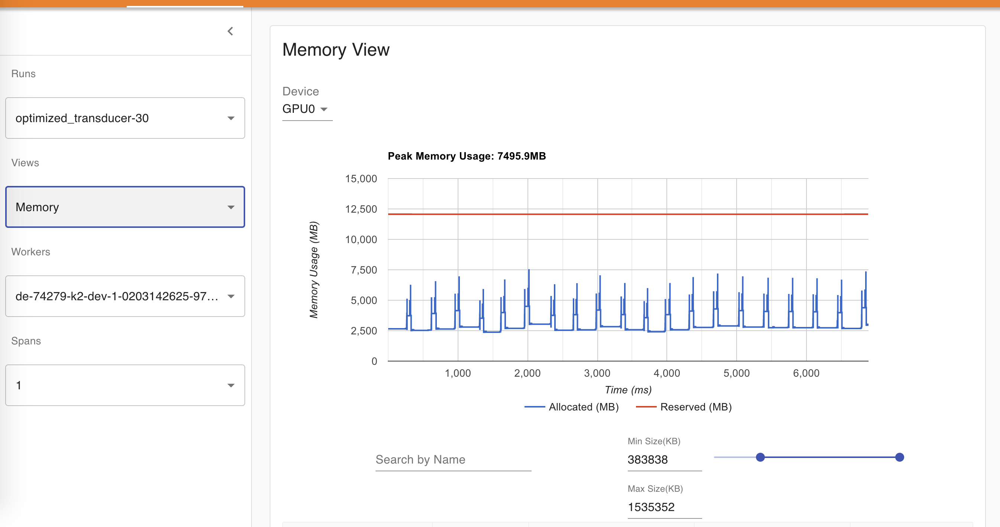|

The following table summarizes the results from the above table

|  Name                  |  Average step time (us)  | Peak memory usage (MB)  |
|------------------------|-------------------------:|------------------------:|
| `torchaudio`           | 544241                   | 18921.8                 |
| `k2`                   | 386808                   | 22056.9                 |
| `k2 pruned`            |  63395                   | 3820.3                  |
| `optimized_transducer` | 376954                   | 7495.9                  |


Some notes to take away:

- For the unpruned case, `optimized_transducer` is the fastest one and takes least memory
- k2 pruned loss is the fastest and requires least memory
- You can use **a larger batch size** during training when using k2 pruned loss


# Sort utterances by duration before batching them up

To minimize the effect of padding, we also benchmark the implementations by sorting
utterances by duration before batching them up.

You can use the option `--sort-utterance`, e.g., `./benchmark_torchaudio.py --sort-utterance true`,
while running the benchmarks.

The following table visualizes the benchmark results for sorted utterances:

|  Name     |  Overview  | Memory  |
|-----------|------------|---------|
|torchaudio | 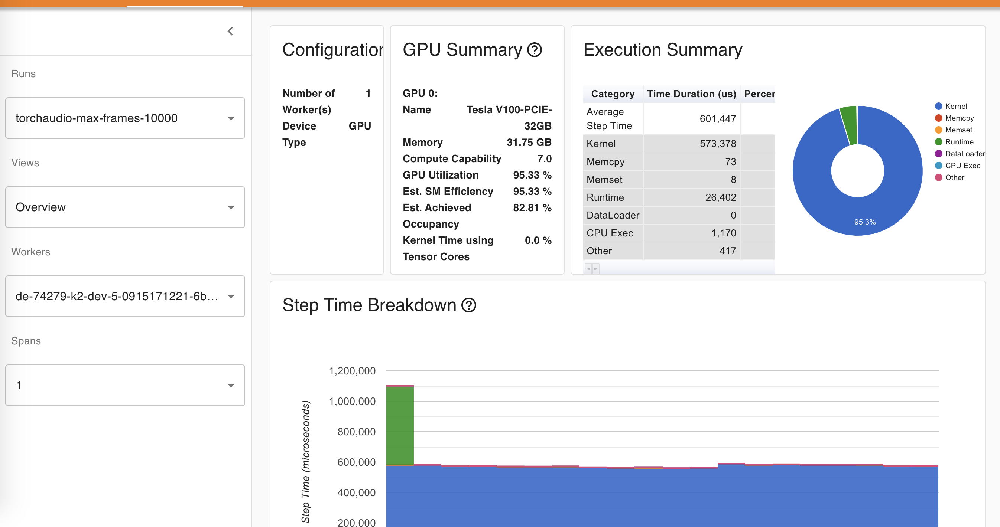 | 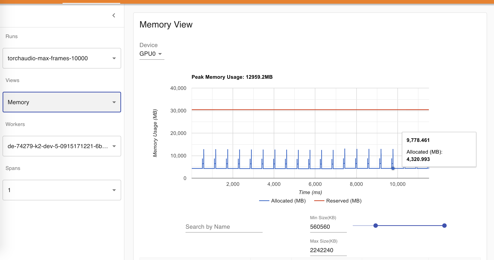|
|k2 | 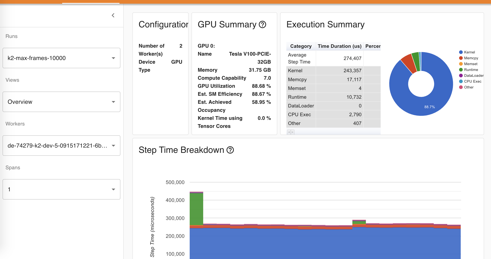 | 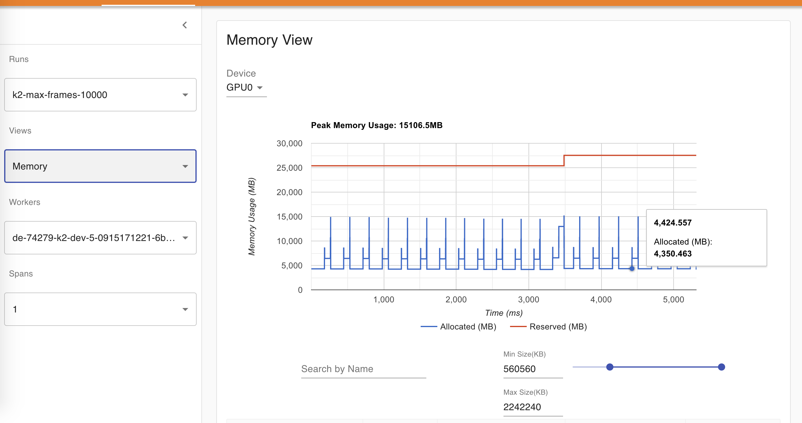|
|k2 pruned | 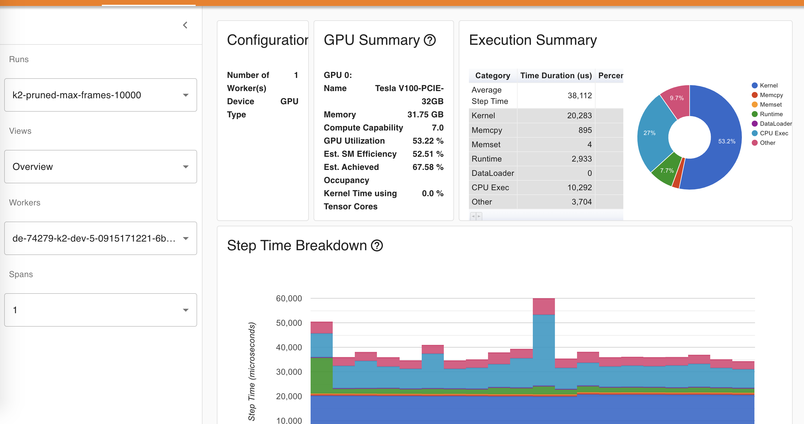 | 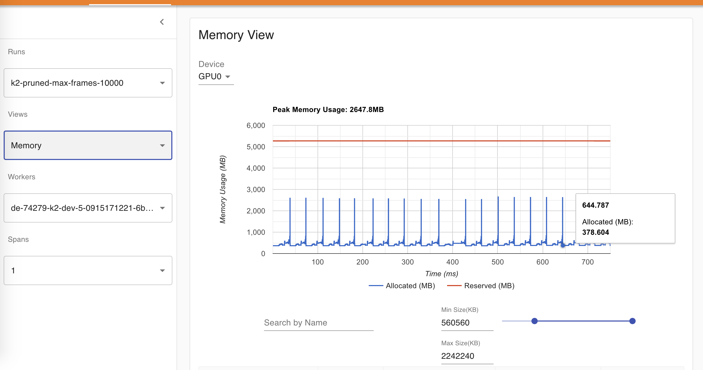|
|`optimized_transducer`| 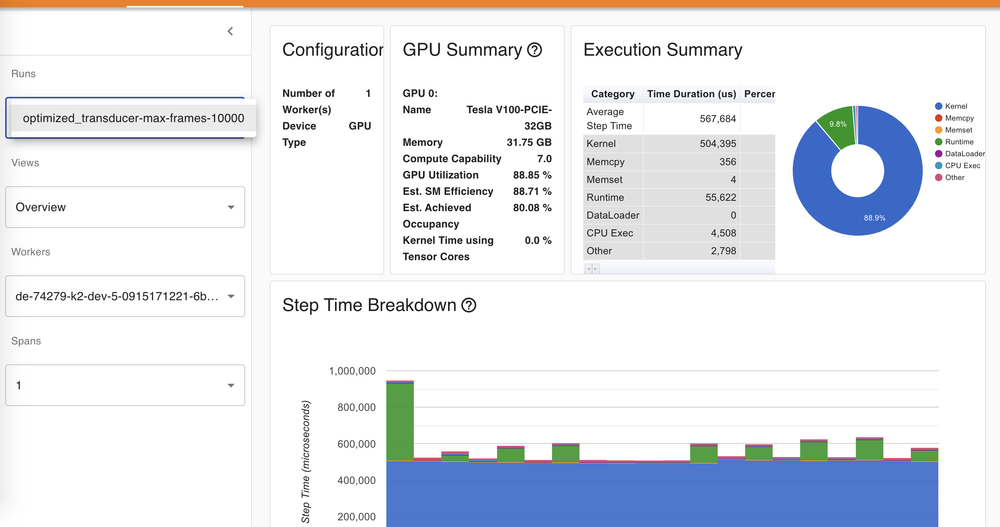 | 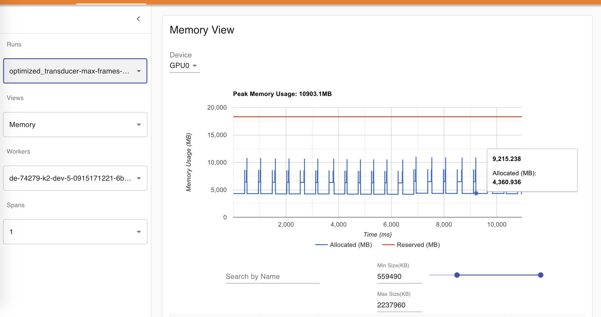|

**Note**: A value 10k for max frames is selected since the value 11k causes CUDA OOM  for k2 unpruned loss.
Max frames is 10k means that the number of frames in a batch before padding is at most 10k.


[k2]: http://github.com/k2-fsa/k2
[torchaudio]: https://github.com/pytorch/audio
[optimized_transducer]: https://github.com/csukuangfj/optimized_transducer
[warp-transducer]: https://github.com/HawkAaron/warp-transducer
[warprnnt_numba]: https://github.com/titu1994/warprnnt_numba
[LibriSpeech]: https://www.openslr.org/12
