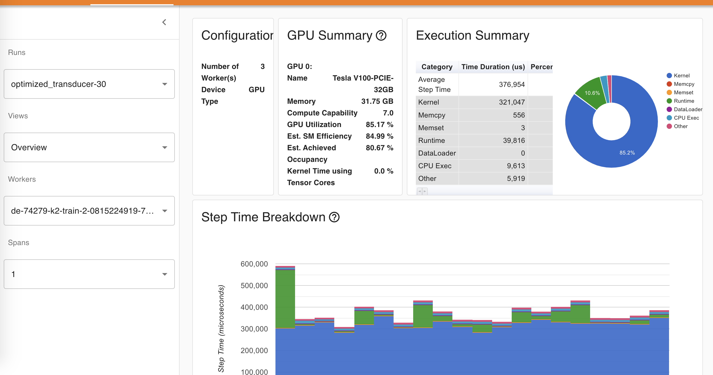
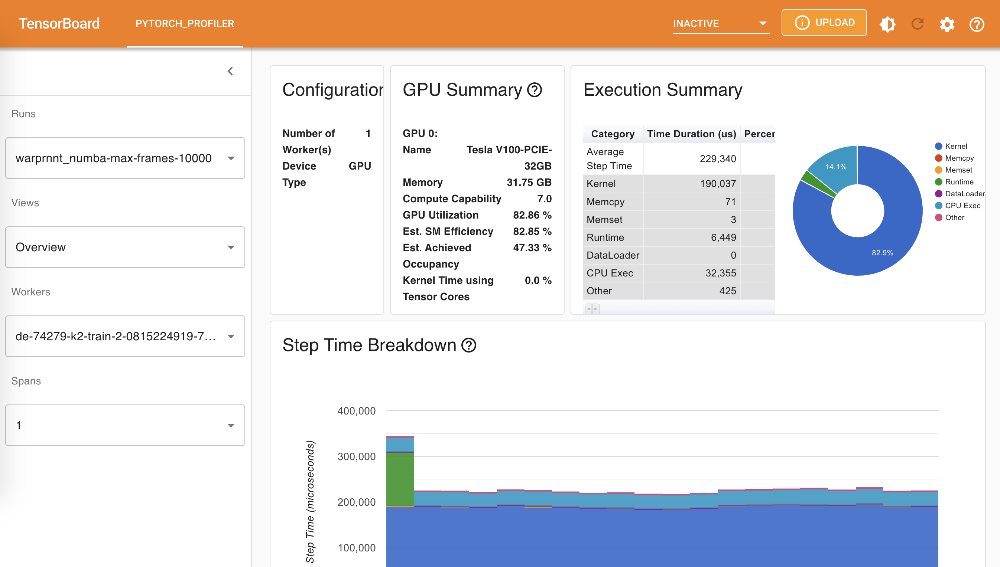

# Introduction

This repo tries to benchmark the following implementations of
transducer loss in terms of speed and memory consumption:

- [k2][k2]
- [torchaudio][torchaudio]
- [optimized_transducer][optimized_transducer]
- [warprnnt_numba][warprnnt_numba]
- [warp-transducer][warp-transducer-espnet]
- [warp-rnnt][warp-rnnt]

The benchmark results are saved in <https://huggingface.co/csukuangfj/transducer-loss-benchmarking>

**WARNING**: Instead of using warp-transducer from <https://github.com/HawkAaron/warp-transducer>,
we use a version that is used and maintained by ESPnet developers.

# Environment setup

## Install torchaudio

Please refer to <https://github.com/pytorch/audio> to install torchaudio.
Note: It requires `torchaudio >= 0.10.0`.

## Install k2

Please refer to <https://k2-fsa.github.io/k2/installation/index.html> to install k2.
Note: It requires at `k2 >= v1.13`.

## Install `optimized_transducer`

```bash
pip install optimized_transducer
```

Please refer to <https://github.com/csukuangfj/optimized_transducer> for other alternatives.

## Install `warprnnt_numba`

```bash
pip install --upgrade git+https://github.com/titu1994/warprnnt_numba
```

Please refer to <https://github.com/titu1994/warprnnt_numba> for more methods.

## Install warp-transducer

```bash
git clone --single-branch --branch espnet_v1.1 https://github.com/b-flo/warp-transducer.git
cd warp-transducer
cd build
cmake -DCMAKE_BUILD_TYPE=Release ..
make -j warprnnt
cd ../pytorch_binding

# Caution: You may have to modify CUDA_HOME to match your CUDA installation
export CUDA_HOME=/usr/local/cuda
export C_INCLUDE_PATH=$CUDA_HOME/include:${C_INCLUDE_PATH}
export CPLUS_INCLUDE_PATH=$CUDA_HOME/include:${CPLUS_INCLUDE_PATH}

python3 setup.py build

# Then add /path/to/warp-transducer/pytorch_binding/build/lib.linux-x86_64-3.8
# to your PYTHONPATH
export PYTHONPATH=/ceph-fj/fangjun/open-source-2/warp-transducer/pytorch_binding/build/lib.linux-x86_64-3.8:$PYTHONPATH

# To test that warp-transducer was compiled and configured correctly, run the following commands
cd $HOME
python3 -c "import warprnnt_pytorch; print(warprnnt_pytorch.RNNTLoss)"
# It should print something like below:
#   <class 'warprnnt_pytorch.RNNTLoss'>

# Caution: We did not used any **install** command.
```

## Install warp_rnnt
```bash
git clone https://github.com/1ytic/warp-rnnt
cd warp-rnnt/pytorch_binding

# Caution: You may have to modify CUDA_HOME to match your CUDA installation
export CUDA_HOME=/usr/local/cuda
export C_INCLUDE_PATH=$CUDA_HOME/include:$CUDA_HOME/targets/x86_64-linux/include:$C_INCLUDE_PATH
export CPLUS_INCLUDE_PATH=$CUDA_HOME/include:$CUDA_HOME/targets/x86_64-linux/include:$CPLUS_INCLUDE_PATH
python3 setup.py build
python3 setup.py install

# To test that warp-rnnt was installed correctly, run the following commands:
cd $HOME
python3 -c "import warp_rnnt; print(warp_rnnt.RNNTLoss)"
# It should print something like below:
#   <class 'warp_rnnt.RNNTLoss'>

```

## Install PyTorch profiler TensorBoard plugin

```bash
pip install torch-tb-profiler
```

Please refer to <https://github.com/pytorch/kineto/tree/main/tb_plugin> for other alternatives.


# Steps to get the benchmark results

## Step 0: Clone the repo

```bash
git clone https://github.com/csukuangfj/transducer-loss-benchmarking.git
```

## Step 1: Generate shape information from training data (Can be skipped)

Since padding matters in transducer loss computation, we get the shape information
for `logits` and `targets` from the subset `train-clean-100` of the [LibriSpeech][LibriSpeech]
dataset to make the benchmark results more realistic.

We use the script <https://github.com/k2-fsa/icefall/blob/master/egs/librispeech/ASR/prepare.sh>
to prepare the manifest of `train-clean-100`. This script also produces a BPE model with vocabulary
size 500.

The script `./generate_shape_info.py` in this repo generates a 2-D tensor, where each row has 2 columns
containing information abut each utterance in `train-clean-100`:
  - Column 0 contains the number of acoustic frames after subsampling, i.e., the `T` in transducer loss computation
  - Column 1 contains the number of BPE tokens, i.e., the `U` in transducer loss computation

**Hint**: We have saved the generated file `./shape_info.pt` in this repo so you don't need
to run this step. If you want to do benchmarks on other dataset, you will find `./generate_shape_info.py`
very handy.

## Step 2: Run benchmarks

We have the following benchmarks so far:


| Name                      |  Script                          | Benchmark Result folder         |
|---------------------------|----------------------------------|---------------------------------|
| `torchaudio`              | `./benchmark_torchaudio.py`      | `./log/torchaudio-30`           |
| `optimized_transducer`    | `./benchmark_ot.py`              | `./log/optimized_transducer-30` |
| `k2`                      | `./benchmark_k2.py`              | `./log/k2-30`                   |
| `k2 pruned loss`          | `./benchmark_k2_pruned.py`       | `./log/k2-pruned-30`            |
| `warprnnt_numba`          | `./benchmark_warprnnt_numba.py`  | `./log/warprnnt_numba-30`       |
| `warp-transducer`         | `./benchmark_warp_transducer.py` | `./log/warp-transducer-30`      |
| `warp-rnnt`               | `./benchmark_warp_rnnt.py`       | `./log/warp-rnnt-30`            |

The first column shows the names of different implementations of transducer loss, the second
column gives the command to run the benchmark, and the last column is the
output folder containing the results of running the corresponding script.

**HINT**: The suffix 30 in the output folder indicates the batch size used during the benchmark.
Batch size 30 is selected since `torchaudio` throws CUDA OOM error if batch size 40 is used.

**HINT**: We have uploaded the benchmark results to
<https://huggingface.co/csukuangfj/transducer-loss-benchmarking>. You can download and visualize
it without running any code.

**Note**: We use the following command for benchmarking:

```python3
prof = torch.profiler.profile(
    activities=[ProfilerActivity.CPU, ProfilerActivity.CUDA],
    schedule=torch.profiler.schedule(
        wait=10, warmup=10, active=20, repeat=2
    ),
    on_trace_ready=torch.profiler.tensorboard_trace_handler(
        f"./log/k2-{batch_size}"
    ),
    record_shapes=True,
    with_stack=True,
    profile_memory=True,
)
```
The first 10 batches are skipped for warm up, the next 10 batches are ignored,
and the subsequent 20 batches are used for benchmarking.


## Step 3: Visualize Results

You can use tensorboard to visualize the benchmark results. For instance, to visualize
the results for `k2 pruned loss`, you can use

```bash
tensorboard --logdir ./log/k2-pruned-30 --port 6007
```

|  Name     |  Overview  | Memory  |
|-----------|------------|---------|
|torchaudio |  | |
|k2 |  | |
|k2 pruned |  | |
|`optimized_transducer`|  | |
|`warprnnt_numba`|  | |
|`warp-transducer`|  | |
|`warp-rnnt`|  | |

The following table summarizes the results from the above table

|  Name                  |  Average step time (us)  | Peak memory usage (MB)  |
|------------------------|-------------------------:|------------------------:|
| `torchaudio`           | 544241                   | 18921.8                 |
| `k2`                   | 386808                   | 22056.9                 |
| `k2 pruned`            |  63395                   |  3820.3                 |
| `optimized_transducer` | 376954                   |  7495.9                 |
| `warprnnt_numba`       | 299385                   | 19072.7                 |
| `warp-transducer`      | 275852                   | 19072.6                 |
| `warp-rnnt`            | 293270                   | 18934.3                 |


Some notes to take away:

- For the unpruned case, `warp-transducer` is the fastest while `optimized_transducer` takes the least memory
- k2 pruned loss is the fastest and requires the least memory
- You can use **a larger batch size** during training when using k2 pruned loss


# Sort utterances by duration before batching them up

To minimize the effect of padding, we also benchmark the implementations by sorting
utterances by duration before batching them up.

You can use the option `--sort-utterance`, e.g., `./benchmark_torchaudio.py --sort-utterance true`,
while running the benchmarks.

The following table visualizes the benchmark results for sorted utterances:

|  Name     |  Overview  | Memory  |
|-----------|------------|---------|
|torchaudio |  | |
|k2 |  | |
|k2 pruned |  | |
|`optimized_transducer`|  | |
|`warprnnt_numba`|  | |
|`warp-transducer`|  | |
|`warp-rnnt`|  | |

**Note**: A value 10k for max frames is selected since the value 11k causes CUDA OOM for k2 unpruned loss.
Max frames with 10k means that the number of frames in a batch before padding is at most 10k.

The following table summarizes the results from the above table

|  Name                  |  Average step time (us)  | Peak memory usage (MB)  |
|------------------------|-------------------------:|------------------------:|
| `torchaudio`           | 601447                   | 12959.2                 |
| `k2`                   | 274407                   | 15106.5                 |
| `k2 pruned`            |  38112                   |  2647.8                 |
| `optimized_transducer` | 567684                   | 10903.1                 |
| `warprnnt_numba`       | 229340                   | 13061.8                 |
| `warp-transducer`      | 210772                   | 13061.8                 |
| `warp-rnnt`            | 216547                   | 12968.2                 |


Some notes to take away:

- For the unpruned case, `warp-transducer` is the fastest one
- `optimized_transducer` still consumes the least memory for the unpruned case
- k2 pruned loss is again the fastest and requires the least memory
- You can use **a larger batch size** during training when using k2 pruned loss


[k2]: http://github.com/k2-fsa/k2
[torchaudio]: https://github.com/pytorch/audio
[optimized_transducer]: https://github.com/csukuangfj/optimized_transducer
[warp-transducer]: https://github.com/HawkAaron/warp-transducer
[warp-transducer-espnet]: https://github.com/b-flo/warp-transducer/tree/espnet_v1.1
[warprnnt_numba]: https://github.com/titu1994/warprnnt_numba
[LibriSpeech]: https://www.openslr.org/12
[warp-rnnt]: https://github.com/1ytic/warp-rnnt/
